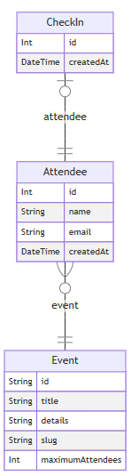
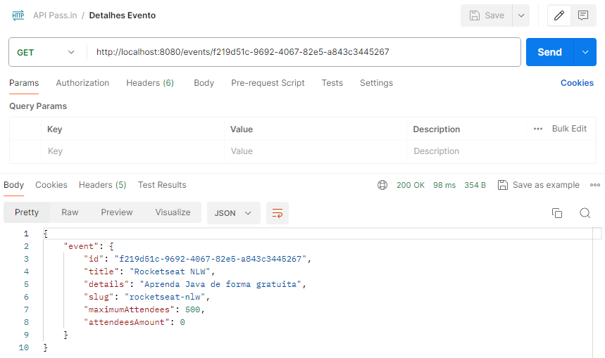

# Pass.in

## Sobre
O Pass.in é uma aplicação de **gestão de participantes em eventos presenciais**.
A ferramenta permite que o organizador cadastre um evento e abra uma página pública de inscrição.
Os participantes inscritos podem emitir uma credencial para check-in no dia do evento.
O sistema fará um scan da credencial do participante para permitir a entrada no evento.

## Imagens

 

## Agradecimentos   
Desenvolvido durante o evento NLW Unite promovido pela [Rocktseat](https://www.rocketseat.com.br/), na trilha Java.
___
**Contato:**  

